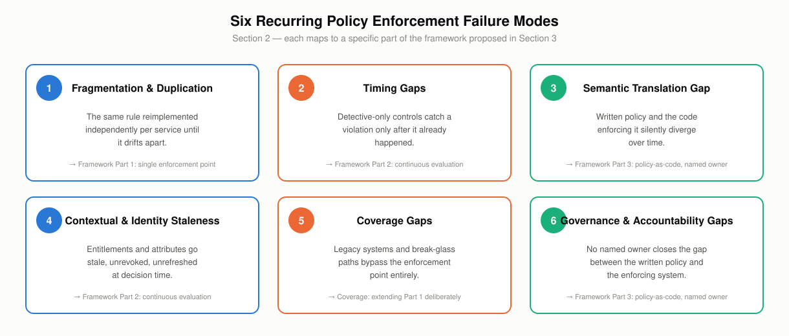
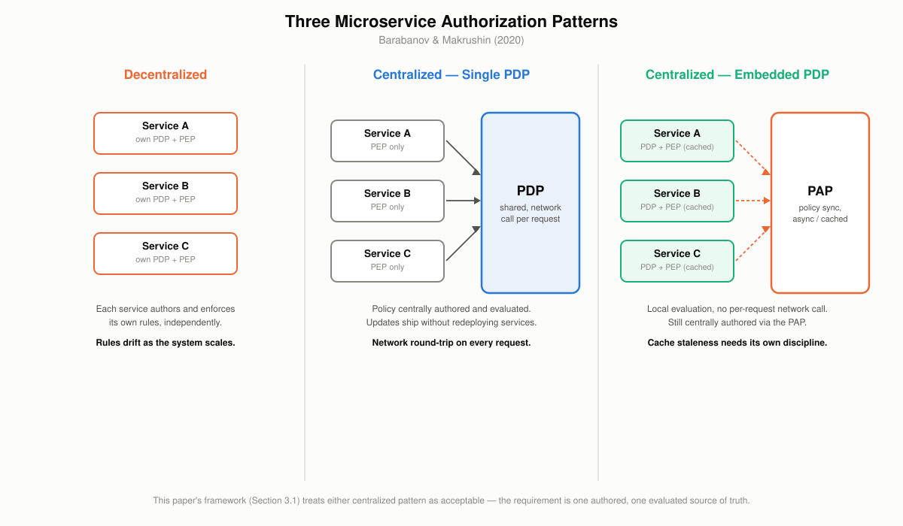
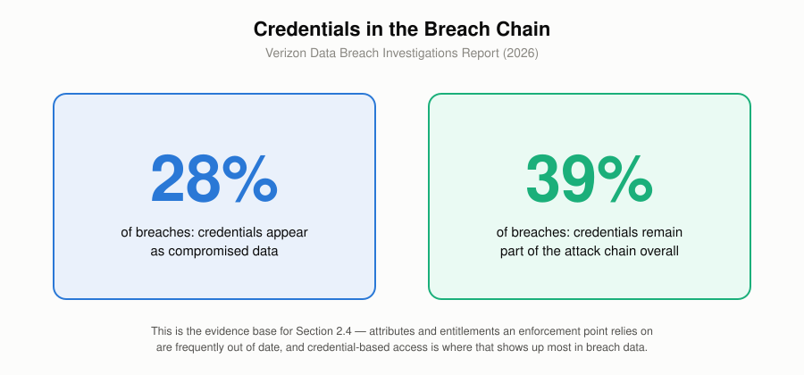
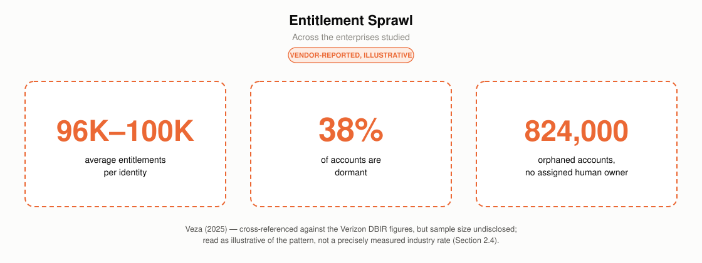
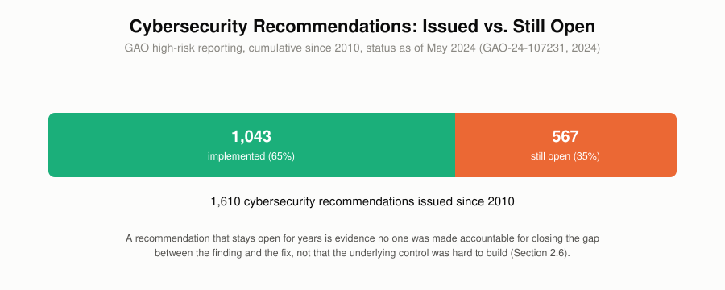
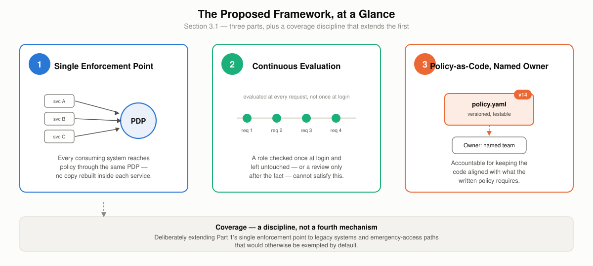
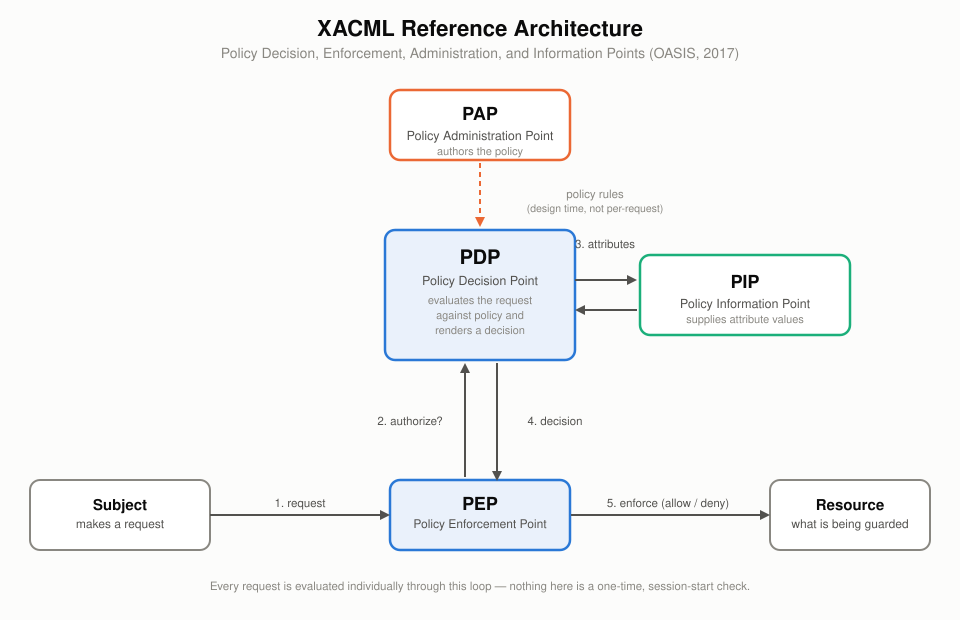
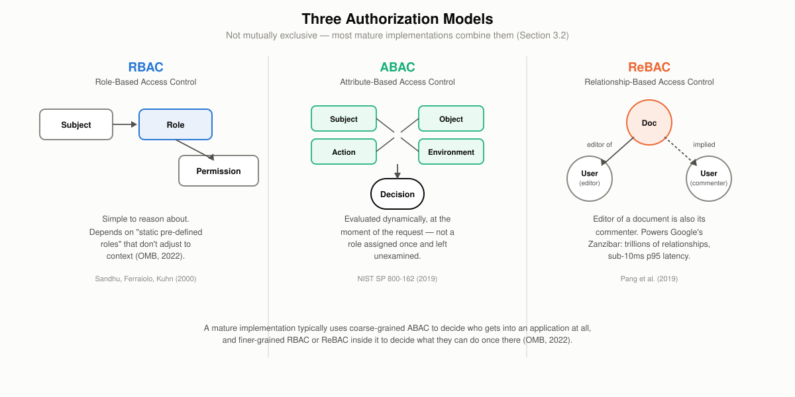
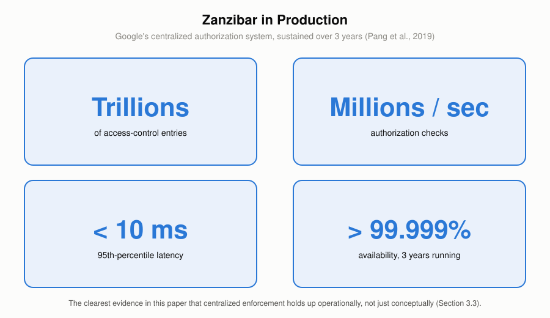

# **Policy Enforcement in the Enterprise: From Fragmented Controls to a Unified Enforcement Framework**

*Krishna Murthy Kodiganti, Senior Lead Software Engineer, Capital One*

*The views expressed in this paper are the author's own and do not represent the views of Capital One.*

---

# **Abstract**

Enterprises across every industry write policy — who may access what, under which conditions, for how long — and then enforce a version of it that has quietly drifted from what was written. Credentials remain part of the attack chain in 39% of breaches, and stolen or compromised credentials appear as compromised data in 28% of breaches, according to the most recent Verizon Data Breach Investigations Report (Verizon, 2026). The recurring cause is a missing enforcement architecture, not a badly designed rule. The same access-control logic gets reimplemented independently across dozens of services until it drifts. A control meant to block an action in real time only logs it for later review. Code enforcing a policy is never checked against what the policy actually says. An entitlement outlives the reason it was granted. A legacy system or an emergency path sits entirely outside whatever central control exists. And no one is named as accountable for closing the gap.

This paper develops a six-category taxonomy of these failure modes and proposes a three-part enforcement framework: a single, centrally evaluated enforcement point in place of fragmented per-service logic; continuous, per-request evaluation against current attributes rather than a role checked once and left stale; and policy expressed as versioned, testable code with a named, auditable owner. The framework is grounded in an existing standard (the OASIS XACML architecture of Policy Decision, Enforcement, Administration, and Information Points) and in production systems already operating at scale — Google's Zanzibar authorization system sustains sub-10-millisecond decision latency and better than 99.999% availability over trillions of access-control entries, and roughly forty organizations, from Netflix to Goldman Sachs, publicly report running a centralized policy engine in production. Banking, healthcare, government, and retail/telecommunications each supply an independent, regulator- or academically-documented example of the same six failure modes recurring across otherwise unrelated industries.

---

# **1. Introduction**

## **Background**

Every enterprise encodes rules about who may do what to which resource: an employee may view their own payroll record but not a colleague's, a support engineer may read a customer's account but not export it, a partner integration may write to one table but not another. Access control is the most direct technical expression of this kind of policy, and it has a standard architecture. The OASIS XACML specification defines four components that recur across most modern authorization systems regardless of vendor: a Policy Administration Point (PAP) where rules are authored, a Policy Decision Point (PDP) that evaluates a request against those rules and renders a decision, a Policy Enforcement Point (PEP) that carries out the decision, and a Policy Information Point (PIP) that supplies the attributes the decision depends on (OASIS, 2017). The National Institute of Standards and Technology's guidance on attribute-based access control (ABAC) describes the same decision as an evaluation of subject, object, action, and environment attributes at the moment of the request, rather than a static, pre-computed answer (NIST, 2019).

That architecture describes how a single, well-run system enforces policy. It says less about what happens once an enterprise has hundreds of services, several cloud providers, a handful of acquired companies' codebases, and a compliance function that writes policy in prose rather than code — the condition Section 2 examines in detail. Google's own engineers, describing the system built to replace independent, per-product access-control logic across Calendar, Drive, Photos, and a dozen other products, framed the alternative plainly: a unified authorization system is what "saves engineering resources" that would otherwise be spent solving the same access-control problem independently, service by service (Pang et al., 2019).

## **Problem Statement**

Enterprises rarely fail at policy enforcement because a rule was badly written. They fail because enforcement itself was never built as shared infrastructure — Section 2 develops the six recurring reasons why. This paper's core question: **how should an enterprise, in any industry, enforce policy consistently and in real time, with a named owner accountable for the gap between what a policy says and what a system does, instead of reproducing the same rule across dozens of systems that are free to drift?**

Section 3 answers that question with a three-part enforcement framework: a single enforcement point, continuous rather than periodic evaluation, and policy-as-code with a named, auditable owner, grounded in the PDP/PEP/PAP/PIP architecture and the RBAC/ABAC/ReBAC model choices available to implement it. Section 4 shows the same six failure modes recurring across banking, healthcare, government, and retail/telecom.

---

# **2. A Taxonomy of Policy Enforcement Failure Modes**

The six categories below recur regardless of industry or technology stack. Each maps to a specific part of the framework proposed in Section 3.

## **2.1 Fragmentation & Duplication**

A survey of microservice authentication and authorization patterns identifies three architectures in production use: a decentralized pattern, where every microservice implements its own PDP and PEP; a centralized pattern with a single, shared PDP; and a centralized pattern with an embedded PDP that caches decisions locally for latency (Barabanov & Makrushin, 2020). The decentralized pattern is the default outcome of ordinary software development, not a deliberate design choice: each team builds authorization into its own service because that is the fastest way to ship. The survey lists the resulting failure mode directly: every development team must independently understand the intended access-control policy correctly, the rules end up "littered through one or more large, complicated codebases," and the pattern "relies on careful manual configuration by the development team, which is error-prone" (Barabanov & Makrushin, 2020). A separate multivocal literature review of 58 studies on microservice security catalogs this as one of ten recurring "bad smells" in production systems, alongside the refactorings needed to fix each one (Ponce et al., 2021).

The pattern is not limited to microservices. Google's Zanzibar paper opens from the same premise at a much larger scale: before Zanzibar, authorization logic was maintained separately by every product team at the company, and a unified system offered three concrete advantages a fragmented one could not — consistent semantics across products, easier interoperation when one application embeds another's objects, and shared infrastructure (such as an access-control-aware search index) that would otherwise need to be rebuilt once per product (Pang et al., 2019). A documented migration project shows the same fix applied at the scale of a single organization: a team replaced a monolithic, hard-coded role-based authorization system with a dedicated, centralized authorization microservice in two phases — first standing up the new service, then retiring the legacy logic it replaced (Abboud & Jacob, 2023).

## **2.2 Timing Gaps**

Policy enforcement can act at three points relative to the action it governs: preventively, blocking a request before it completes; detectively, logging or flagging it for review after the fact; or correctively, reversing or remediating an action already taken. The distinction matters because a control that only detects a violation has, by definition, already let the underlying action happen. NIST's Zero Trust Architecture guidance treats real-time, preventive evaluation as the default: every access request is evaluated and enforced individually through a PDP/PEP pair, with logging and monitoring kept as a distinct, forensic function rather than a stand-in for that evaluation (NIST, 2020). The federal government's own Zero Trust mandate states the requirement in operational terms: "every request for access should be evaluated to determine whether it is appropriate," which "requires the ability to continuously evaluate any active session," not just the credential presented at login (OMB, 2022).

The same memorandum names why static, role-based models struggle to meet that bar on their own: RBAC "relies on static pre-defined roles that are assigned to users and determine their permissions," and a zero trust architecture needs the more granular, dynamically evaluated permissions that attribute-based access control (ABAC) is designed to provide instead (OMB, 2022). An enforcement point built only to check a role at session start, with no mechanism to re-evaluate as conditions change mid-session, is a timing gap by construction, independent of whether the role itself was ever correct. Section 4 shows two industry examples — a legacy retailer and a telecommunications carrier — where a detective-only posture let a violation continue for weeks or months after it began.

## **2.3 Semantic Translation Gap**

A written policy and the code that enforces it are two different artifacts, produced by different people, and nothing keeps them in sync automatically. The research motivating Margrave, a verifier for XACML-based access-control policies, states the failure mode directly: when a policy is hard-coded into the program that uses it, "tracing the policy when maintaining the program becomes very difficult, since its implementation is likely to be scattered across the codebase," and it becomes "onerous to share the same policy across multiple different programs and to change the policy consistently" once it is (Fisler et al., 2005). Margrave's response was to treat policy verification as a first-class problem: compile a policy into a decision diagram, check it against a stated property, and compute a semantic diff between two versions of a policy to show exactly how a change alters who is authorized (Fisler et al., 2005).

Open Policy Agent (OPA), the most widely adopted general-purpose policy engine in production use today, addresses the coupling half of this problem — decisions are made by evaluating structured input against a policy the engine holds separately from the application, not by application code with policy logic embedded inside it (OPA documentation, cited via CNCF, 2020). OPA's own documentation does not, however, provide any built-in way to prove that a given version of a coded policy still matches what the policy was intended to say; verifying intent, as opposed to just centralizing evaluation, is a different problem. Cedar, a newer authorization language, is built specifically to close that remaining gap: its policies are formalized in the Lean proof assistant with machine-checked properties, so that a change to a policy — for example, a refactor intended to be behavior-preserving — can be proven not to silently change who is authorized, instead of merely trusted on inspection (Cutler et al., 2024). Cedar is a preprint at time of writing and has not yet been confirmed as peer-reviewed at a formal venue.

## **2.4 Contextual & Identity Staleness**

ABAC's core premise is that an authorization decision should reflect the current state of the subject, object, and environment, not a role assigned once and left unexamined (NIST, 2019). In practice, the attributes and entitlements an enforcement point relies on are frequently out of date. Verizon's most recent Data Breach Investigations Report found that credentials appear as compromised data in 28% of breaches and remain part of the attack chain in 39% of breaches overall, even as credential theft's share of *initial* access fell for the first time in the report's nineteen-year history as vulnerability exploitation overtook it (Verizon, 2026). A vendor-reported analysis of enterprise identity and access data, cross-referenced against the Verizon figures above and disclosed here as illustrative, not independently audited, found an average of 96,000 to 100,000 entitlements per identity, 38% of accounts dormant, and 824,000 orphaned accounts with no assigned human owner across the enterprises studied (Veza, 2025).

Two distinct problems sit inside this category, and the evidence for them is not equally strong. Entitlement creep and orphaned accounts — permissions that accumulate and are never revoked — are well documented, including in the named healthcare incident in Section 4. Attribute staleness in the narrower sense — a device-posture score, a risk score, or an employment-status flag not refreshed at the moment a decision is made — is a real architectural risk implied directly by the ABAC and Zero Trust literature above. No primary or peer-reviewed source measuring it as its own phenomenon turned up in this paper's research, and that gap is flagged here rather than filled with an invented figure.

## **2.5 Coverage Gaps**

A centralized enforcement point only protects the traffic that actually reaches it. Legacy systems, emergency "break-glass" access paths, and unmanaged shadow IT are three ways a system can sit entirely outside whatever policy engine an enterprise has built. Break-glass paths exist for a legitimate reason — the HIPAA Security Rule itself requires covered entities to "establish (and implement as needed) procedures for obtaining necessary electronic protected health information during an emergency" (45 CFR § 164.312(a)(2)(ii)) — but a path built for a genuine emergency is also a path with weaker real-time scoping than the standard enforcement point, and it can be used outside the emergency it was built for. A 2023 HHS Office for Civil Rights settlement illustrates the risk directly: 23 emergency-department security guards at a hospital used their own valid, standard login credentials, not an emergency override, to access approximately 419 patients' records with no job-related purpose, over a period beginning in 2018, resulting in a $240,000 settlement and a two-year corrective action plan (HHS OCR, 2023). The access was legitimate by credential and illegitimate by scope, which a coverage gap in enforcement (no technical control limiting standard access to its intended purpose) allowed to continue undetected for years.

Quantifying how much of an enterprise's footprint sits in this kind of gap is harder than documenting that it exists. Frequently cited figures that shadow IT accounts for 30–40% or more of enterprise IT spend could not be traced back to a primary source in this paper's research; every instance found was a vendor blog restating the number secondhand. That prevalence figure is real in kind but not precisely measured: every version of it traces back to someone restating someone else's number, not to a primary study.

## **2.6 Governance & Accountability Gaps**

A policy engine can be correctly built, centrally deployed, and evaluated in real time, and still fail if no one owns the connection between what a written policy says and what the engine actually enforces. Standards bodies increasingly treat this as a distinct requirement rather than an implicit expectation. NIST's Cybersecurity Framework 2.0 added a dedicated "Govern" function — new in that revision — specifically to establish clear ownership, roles, and reporting structure for cybersecurity policy, instead of leaving it owned informally by whichever team happens to run the enforcement tooling (NIST, 2024). ISO/IEC 27001:2022 goes further and makes the requirement explicit at the level of a single clause: an information security policy must have named top-management approval and a documented review at least annually or upon material change (ISO/IEC 27001:2022, Clause 5.2).

The U.S. Government Accountability Office's recurring high-risk reporting shows what happens without that discipline at scale: in 2017, GAO found persistent, unresolved control weaknesses — spanning access control, configuration management, and segregation of duties — recurring across all twenty-four CFO Act agencies over multiple audit cycles (GAO-17-549, 2017). Seven years later, GAO's 2024 high-risk update found the same underlying pattern: of 1,610 cybersecurity recommendations issued since 2010, 567 remained unimplemented as of May 2024 (GAO-24-107231, 2024). A recommendation that stays open for years is evidence that no one was made accountable for closing the gap between the finding and the fix, not that the underlying control was hard to build.

---

# **3. The Proposed Framework: Policy Enforcement as Infrastructure**

## **3.1 Overview**

The six failure modes in Section 2 share a common cause: enforcement is treated as something each system builds for itself, on its own schedule, with no shared point of truth. The proposed framework has three parts. First, a single enforcement point: one centrally defined and evaluated set of policies that every consuming system reaches through the same PDP, instead of a copy of the same logic rebuilt inside each service. Second, continuous evaluation: every request assessed against current attributes at the moment it is made. A role checked once at login and left untouched for the rest of the session cannot satisfy this on its own, and neither can a review that only happens after the fact. Third, policy-as-code with a named, auditable owner: policy expressed as a versioned, testable artifact, with a specific person or team accountable for keeping it aligned with what the written policy actually requires — not just for keeping the engine running. Coverage is a discipline, not a fourth mechanism: it means deliberately extending the single enforcement point in the first part of the framework to legacy systems and emergency-access paths that would otherwise be exempted by default.

## **3.2 Implementation and Methodology**

The architecture is the one defined by OASIS XACML: policy is authored at a Policy Administration Point, evaluated by a Policy Decision Point against attributes supplied by a Policy Information Point, and the resulting decision is carried out by a Policy Enforcement Point (OASIS, 2017).

Which authorization model the PDP evaluates against is a second, largely independent decision. Role-based access control (RBAC) assigns permissions to roles and roles to subjects — simple to reason about, but, as OMB's own Zero Trust guidance notes, dependent on "static pre-defined roles" that do not adjust to context (OMB, 2022; Sandhu et al., 2000). Attribute-based access control (ABAC) evaluates subject, object, action, and environment attributes directly, trading some of RBAC's simplicity for the dynamic, context-sensitive evaluation Section 2.4 requires (NIST, 2019). Relationship-based access control (ReBAC) — the model behind Google's Zanzibar — expresses permissions as relationships between objects (a document's editor is also its commenter, a folder's viewer can see everything inside it) and has been shown to scale to trillions of relationships with sub-10-millisecond evaluation latency in production (Pang et al., 2019). The three models are not mutually exclusive; a mature implementation typically uses coarse-grained ABAC to decide who gets into an application at all and finer-grained RBAC or ReBAC inside it to decide what they can do once there (OMB, 2022).

Open Policy Agent and Cedar are the two concrete policy-as-code implementations discussed in Section 2.3, and they represent two different points on the verification spectrum: OPA centralizes evaluation and decouples policy from application code, but leaves verifying that a policy still means what it was intended to mean as a manual, out-of-band exercise; Cedar formalizes policies with machine-checked proofs specifically so that exercise can be automated (OPA documentation, cited via CNCF, 2020; Cutler et al., 2024). NIST's more recent guidance on Zero Trust in cloud-native, multi-cloud environments extends the same PDP/PEP model to the specific problem of where the PDP should physically sit when an enterprise's PEPs are spread across several cloud providers rather than one data center (NIST, 2024a).

## **3.3 Benefits and Outcomes**

The clearest evidence that centralized enforcement holds up operationally, not just conceptually, comes from Zanzibar's own production figures: trillions of access-control entries, millions of authorization checks per second, 95th-percentile latency under 10 milliseconds, and better than 99.999% availability sustained over three years, serving products used by more than a billion people (Pang et al., 2019).

Independent adoption by other organizations is documented directly by OPA's maintainers: the project's public adopters list includes Netflix, Goldman Sachs, Cloudflare, T-Mobile, Atlassian, BNY Mellon, and Pinterest, among roughly forty organizations that describe production use of a single centralized policy engine for purposes ranging from Kubernetes admission control to CI/CD guardrails to microservice authorization (OPA project ADOPTERS list, 2020–present). Pinterest's own entry reports handling roughly 400,000 authorization queries per second uncached, and 8.5 million per second cached, across Kafka, Envoy, and Jenkins. These are adoption and scale figures, self-reported by each organization. They are not an independently audited before-and-after comparison of incident rates, and this paper does not treat them as one.

Regulators are also treating this shift as a requirement, not a best practice. OMB's Zero Trust mandate gave every U.S. civilian federal agency a fixed deadline — the end of fiscal year 2024 — to move from static, perimeter-based access control toward the continuously evaluated model described in Section 3.1 (OMB, 2022). No primary, methodologically independent study directly compares breach cost or incident rate between centralized and fragmented enforcement. The best available proxy is the IBM/Ponemon Cost of a Data Breach Report, which puts the average global cost of a breach at $4.44 million and the average U.S. cost at $10.22 million (IBM/Ponemon, 2025) — vendor-commissioned survey research rather than a peer-reviewed study of enforcement architecture, useful here only as order-of-magnitude context.

---

# **4. Cross-Industry Evidence**

The taxonomy in Section 2 is not specific to any one sector. Four industries illustrate different failure modes from the same list.

**Banking.** In October 2020, the Office of the Comptroller of the Currency assessed a $400 million civil money penalty against Citibank, N.A., alongside a consent order requiring the bank to close "gaps between the Bank's current data governance state" and to establish "clear roles, responsibilities, and accountability" for its data governance and internal control functions (OCC, 2020). The finding is a governance-and-accountability gap in the exact sense of Section 2.6: an enterprise can have extensive controls in place and still be found deficient because no one was clearly accountable for the space between what those controls were supposed to guarantee and what they actually delivered.

**Healthcare.** The 2023 Yakima Valley Memorial Hospital settlement described in Section 2.5 shows a coverage gap in a regulated industry with an unusually explicit legal framework for access control: HIPAA both requires an emergency-access procedure and, separately, requires access to be limited to what a role's legitimate job function needs (45 CFR § 164.312(a)(2)(ii); HHS OCR, 2023). The hospital's staff used valid, standard credentials, not an emergency override, so the missing piece was never the control itself. It was a technical boundary tying that standard access to its intended scope, and its absence let the pattern continue for years before a tip triggered an investigation.

**Government.** The U.S. federal government has known about its own access-control and configuration-management weaknesses for a long time without closing them. GAO's 2017 review found persistent weaknesses recurring across all twenty-four CFO Act agencies (GAO-17-549, 2017); its 2024 high-risk update found 567 of 1,610 cybersecurity recommendations issued since 2010 still unimplemented (GAO-24-107231, 2024). The remedy for exactly this pattern already carries a federal mandate: OMB's Zero Trust directive (Section 3.3) required every civilian agency to move toward continuous, per-request evaluation by the end of FY2024. A mandate is not the same thing as an enforced fact on the ground, and the distance between the two is itself a governance-and-accountability failure, playing out at the scale of an entire government.

**Retail and Telecommunications.** Target's 2013 breach and T-Mobile's 2021–2023 breaches show the same timing gap in two different eras of the same industry. Attackers reached Target's point-of-sale environment using credentials stolen from an HVAC vendor's billing-system access, after apparently crossing a network boundary that should have kept vendor and payment systems separate; the company's own intrusion-detection tooling generated alerts during the attack, but those alerts were not acted on in time to stop the exfiltration (CRS R43496, 2015). A decade later, the Federal Communications Commission's September 2024 settlement with T-Mobile — a $15.75 million civil penalty plus a required $15.75 million cybersecurity investment — resolved investigations into breaches across 2021, 2022, and 2023, and required the company to adopt a modern zero-trust architecture with network segmentation, broad multi-factor authentication, and regular board-level reporting from the Chief Information Security Officer (FCC, 2024). In both cases, a control existed somewhere in the environment; in neither case was it positioned, or evaluated continuously enough, to stop the action before the damage was done. The FCC's required remedy is, point for point, the framework this paper proposes.

---

# **5. Conclusion**

The same six problems — fragmentation, timing gaps, the semantic drift between policy and code, stale entitlements, coverage gaps, and unowned governance — recur whether the enterprise is a bank, a hospital, a federal agency, or a telecommunications carrier. None of these are exotic failures that need novel technology to fix. The architecture already exists: a single Policy Decision Point evaluated continuously against current attributes, expressed as versioned, testable policy with a named owner, standardized by OASIS XACML and NIST's ABAC and Zero Trust guidance, and already running in production at global scale in systems like Zanzibar and the roughly forty organizations publicly using Open Policy Agent. What has been missing in most enterprises is the decision to treat enforcement as shared infrastructure, not the technology to do it.

---

# **Contact Information**

*Krishna Murthy Kodiganti, Senior Lead Software Engineer, Capital One*

*The views expressed in this paper are the author's own and do not represent the views of Capital One.*

---

# **Sources**

Organized into three tiers by evidentiary weight: primary, regulatory, and standards sources; peer-reviewed academic literature; and industry research or vendor publications. The tiering makes sourcing quality visible rather than implying lower tiers are unreliable — see the note at the end of this section.

**Primary, Regulatory & Standards Sources**

1. OASIS (2017). *XACML Version 3.0 Plus Errata 01.* https://docs.oasis-open.org/xacml/3.0/xacml-3.0-core-spec-en.html
2. National Institute of Standards and Technology (2019). *SP 800-162, Guide to Attribute Based Access Control (ABAC) Definition and Considerations* (updated Aug. 2, 2019). https://csrc.nist.gov/pubs/sp/800/162/upd2/final
3. National Institute of Standards and Technology (2020). *SP 800-207, Zero Trust Architecture.* https://nvlpubs.nist.gov/nistpubs/specialpublications/NIST.SP.800-207.pdf
4. National Institute of Standards and Technology (2024a). *SP 800-207A, A Zero Trust Architecture Model for Access Control in Cloud-Native Applications in Multi-Location Environments.* https://nvlpubs.nist.gov/nistpubs/SpecialPublications/NIST.SP.800-207A.pdf
5. National Institute of Standards and Technology (2024). *The NIST Cybersecurity Framework (CSF) 2.0.* DOI 10.6028/NIST.CSWP.29. https://www.nist.gov/cyberframework
6. Sandhu, R., Ferraiolo, D., Kuhn, R. (2000). *The NIST Model for Role-Based Access Control: Towards a Unified Standard.* RBAC 2000, 5th ACM Workshop on Role-Based Access Control. https://csrc.nist.gov/pubs/conference/2000/07/26/nist-model-for-rbac-towards-a-unified-standard/final
7. Office of Management and Budget (2022). *M-22-09, Moving the U.S. Government Toward Zero Trust Cybersecurity Principles.* https://www.whitehouse.gov/wp-content/uploads/2022/01/M-22-09.pdf
8. U.S. Government Accountability Office (2017). *GAO-17-549, Federal Information Security: Weaknesses Continue to Indicate Need for Effective Implementation of Policies and Practices.* https://www.gao.gov/products/gao-17-549
9. U.S. Government Accountability Office (2024). *GAO-24-107231, High-Risk Series: Urgent Action Needed to Address Critical Cybersecurity Challenges Facing the Nation.* https://www.gao.gov/products/gao-24-107231
10. Code of Federal Regulations. *45 CFR § 164.312(a)(2)(ii) — HIPAA Security Rule, Emergency Access Procedure.* https://www.law.cornell.edu/cfr/text/45/164.312
11. U.S. Department of Health and Human Services, Office for Civil Rights (2023). *Resolution Agreement: Yakima Valley Memorial Hospital* (reported via GovInfoSecurity). https://www.govinfosecurity.com/hospital-fined-240k-for-records-snooping-breach-by-guards-a-22305
12. Office of the Comptroller of the Currency (2020). *Consent Order: Citibank, N.A.*, AA-EC-2020-64 (Oct. 7, 2020). https://www.occ.gov/static/enforcement-actions/ea2020-056.pdf
13. Congressional Research Service (2015). *R43496, The Target and Other Financial Data Breaches: Frequently Asked Questions.* https://www.everycrsreport.com/reports/R43496.html
14. Federal Communications Commission (2024). *FCC Reaches Multi-Million Dollar Settlement of Investigations into T-Mobile Data Breaches* (Sept. 30, 2024). https://docs.fcc.gov/public/attachments/DOC-405937A1.pdf
15. International Organization for Standardization (2022). *ISO/IEC 27001:2022, Clause 5.2 — Information Security Policy* (cited via ISMS.online's clause guide; the standard itself is paywalled). https://www.isms.online/iso-27001/requirements-2022/5-2-information-security-policy-2022/

**Academic & Peer-Reviewed Literature**

16. Pang, R., Cáceres, R., Burrows, M., et al. (2019). *Zanzibar: Google's Consistent, Global Authorization System.* USENIX Annual Technical Conference 2019. https://www.usenix.org/conference/atc19/presentation/pang
17. Barabanov, A., Makrushin, D. (2020). *Authentication and Authorization in Microservice-Based Systems: Survey of Architecture Patterns.* arXiv:2009.02114. https://arxiv.org/abs/2009.02114
18. Ponce, F., Soldani, J., Astudillo, H., Brogi, A. (2021). *Smells and Refactorings for Microservices Security: A Multivocal Literature Review.* arXiv:2104.13303. https://arxiv.org/abs/2104.13303
19. Abboud, R., Jacob, F. (2023). *Implementation of a New Authorization System from Monolithic Solution to Microservice Architecture.* arXiv:2307.05994. https://arxiv.org/abs/2307.05994
20. Fisler, K., Krishnamurthi, S., Meyerovich, L.A., Tschantz, M.C. (2005). *Verification and Change-Impact Analysis of Access-Control Policies.* Proceedings of ICSE 2005. https://cs.brown.edu/people/kfisler/Pubs/icse05.pdf
21. Cutler, J., Disselkoen, C., et al. (2024). *Cedar: A New Language for Expressive, Fast, Safe, and Analyzable Authorization* (Extended Version). arXiv:2403.04651 — a preprint, not yet confirmed peer-reviewed at a formal venue. https://arxiv.org/abs/2403.04651

**Industry Research & Vendor Sources**

22. Verizon (2026). *Data Breach Investigations Report.* https://www.verizon.com/business/resources/reports/dbir/
23. Veza (2025). *2026 State of Identity & Access* (vendor survey; sample size not disclosed, cross-referenced against the Verizon DBIR above). https://veza.com/company/press-room/veza-identity-access-research-report-reveals-identity-permissions-sprawl-has-reached-critical-levels-amid-explosion-of-machine-and-ai-agent-identities-across-the-enterprise/
24. Cloud Native Computing Foundation (2020). *Introducing Policy As Code: The Open Policy Agent (OPA).* https://www.cncf.io/blog/2020/08/13/introducing-policy-as-code-the-open-policy-agent-opa/
25. Open Policy Agent project (2020–present). *ADOPTERS.md* — self-reported production users, not independently audited. https://github.com/open-policy-agent/opa/blob/main/ADOPTERS.md
26. IBM Security / Ponemon Institute (2025). *Cost of a Data Breach Report 2025* — vendor-commissioned survey research, cited as order-of-magnitude context only. https://www.ibm.com/reports/data-breach

**A note on sourcing quality.** Sources 22–26 above are vendor or vendor-commissioned research and are used only where no primary or peer-reviewed alternative was found in this paper's research, and only for illustrative figures, never as the sole basis for a taxonomy claim. Sources 11 and 15 are primary regulatory/standards actions read via a secondary report rather than the issuing body's own page directly (both returned access errors on direct fetch); the facts cited from them are corroborated across multiple independent secondary reports of the same underlying document. Source 8 (GAO-17-549) is cited only for its general, confirmed finding — persistent control weaknesses recurring across all 24 CFO Act agencies — not for specific weakness counts, which circulated only in secondary aggregation and were not independently confirmed against the primary PDF.
